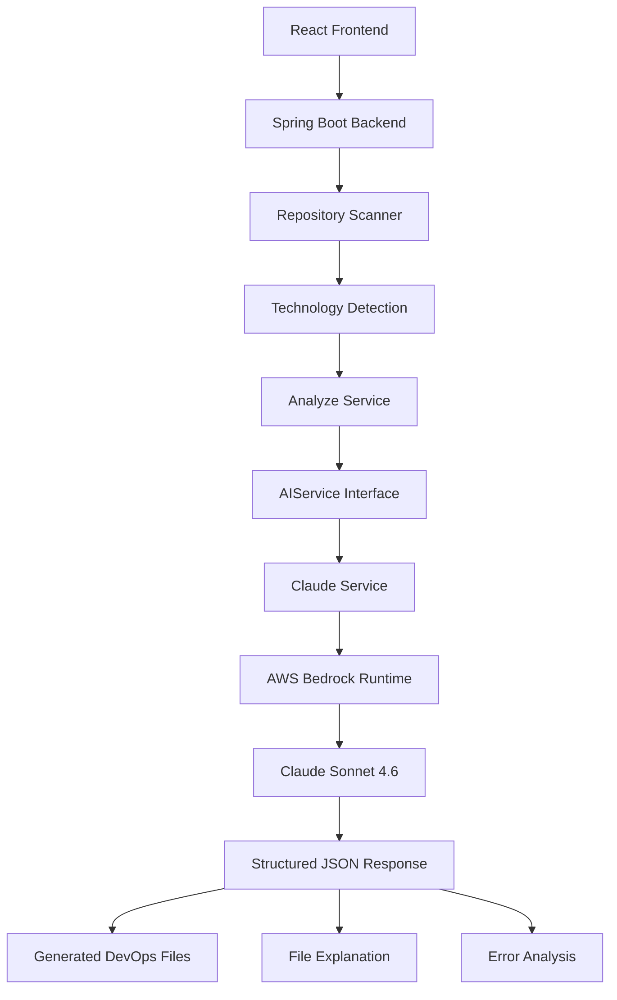
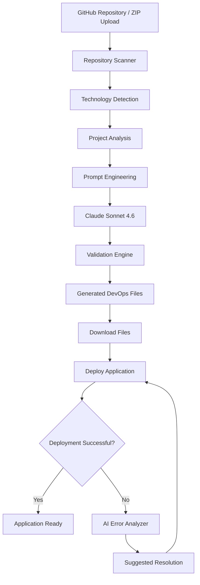

# 🚀 DevForge – AI-Powered DevOps Automation Agent

> **Transform any software repository into production-ready DevOps infrastructure using Artificial Intelligence.**


---

# 📌 Problem Statement

Modern software development has evolved rapidly, but deployment preparation remains one of the most repetitive and time-consuming phases of the development lifecycle.

Before deploying an application, developers are required to manually create and configure:

- Dockerfiles
- Docker Compose configurations
- Environment files
- Deployment configurations
- CI/CD workflows

This process often requires significant DevOps expertise and leads to inconsistent deployment practices, longer release cycles, and increased debugging effort.

---

# 💡 Proposed Solution

**DevForge** is an AI-powered DevOps Engineering Assistant designed to bridge the gap between software development and deployment.

Instead of manually preparing deployment infrastructure, developers simply provide their repository, and DevForge automatically:

- Understands the complete project architecture
- Detects the technology stack
- Generates production-ready DevOps configuration files
- Explains generated configurations
- Diagnoses deployment failures
- Recommends actionable fixes

The result is a faster, standardized, and more reliable deployment workflow.

---

# ✨ Features

- 🔍 Intelligent Repository Analysis
- 🤖 AI-Powered DevOps Configuration Generation
- 🐳 Dockerfile Generation
- 📦 Docker Compose Generation
- 📄 Environment & Deployment File Generation
- 📚 AI-Based File Explanation
- ⚠️ Intelligent Deployment Error Analyzer
- ☁️ AWS Bedrock Integration
- 🧠 Claude Sonnet 4.6 Powered
- 🧩 Modular Multi-LLM Ready Architecture
- ✅ Validation Layer for Reliable Outputs
- 🚀 Production-Oriented Backend Design

---

# 🎯 Application Preview

## 🏠 Home Dashboard


---

## 🔍 Repository Analysis


---

## 📦 Generated DevOps Files


---

## ⚠️ AI Error Analyzer


---

# 🏗 System Architecture



---

# 🔄 Application Workflow



---

# 📂 Project Structure

```text
DevForge
│
├── backend
│   ├── controller
│   ├── service
│   ├── config
│   ├── dto
│   ├── util
│   ├── resources
│   └── pom.xml
│
├── frontend
│   ├── src
│   ├── components
│   ├── pages
│   ├── assets
│   └── package.json
│
├── docs
│   └── images
│       ├── home.png
│       ├── analysis.png
│       ├── generated-files.png
│       └── error-analyzer.png
│
└── README.md
```

---

# ⚙️ Technology Stack

## Frontend

- React.js
- HTML5
- CSS3
- JavaScript

---

## Backend

- Java 17
- Spring Boot
- Spring MVC
- Spring WebFlux
- Maven

---

## AI Layer

- AWS Bedrock Runtime
- Claude Sonnet 4.6

---

## DevOps

- Docker
- Docker Compose

---

## Utilities

- Jackson Databind
- Git

---

# 🤖 AI Workflow

```text
Repository Upload
        │
        ▼
Repository Scanner
        │
        ▼
Technology Detection
        │
        ▼
Project Structure Analysis
        │
        ▼
Prompt Engineering
        │
        ▼
Claude Sonnet 4.6 (AWS Bedrock)
        │
        ▼
Structured JSON Output
        │
        ├───────────────┐
        ▼               ▼
Generate Files   Explain Files
        │               │
        └───────┬───────┘
                ▼
      Deployment Error Analysis
                ▼
      Recommended Resolution
```

---

# 📦 Generated DevOps Files

Depending upon the detected project architecture, DevForge can automatically generate:

- Dockerfile
- Docker Compose Configuration
- Environment Files
- Deployment Instructions
- Production Recommendations
- Containerization Best Practices

---

# ⚠️ AI Deployment Error Analyzer

Developers simply paste deployment logs or terminal errors into the platform.

DevForge analyzes the issue and returns:

- Error Meaning
- Possible Causes
- Step-by-Step Resolution
- Deployment Best Practices
- Additional Recommendations

### Example

```text
COPY failed:
target/*.jar not found
```

Output

```json
{
  "errorMeaning": "Docker could not locate the generated JAR file.",
  "possibleCauses": [
    "Project was not packaged",
    "Incorrect Dockerfile COPY path"
  ],
  "stepByStepFix": [
    "Run mvn clean package",
    "Verify the target directory",
    "Rebuild the Docker image"
  ],
  "extraTips": [
    "Always package the project before containerization."
  ]
}
```

---

# 🚀 Getting Started

## Clone Repository

```bash
git clone <repository-url>

cd DevForge
```

---

## Backend

```bash
cd backend

mvn clean install

mvn spring-boot:run
```

---

## Frontend

```bash
cd frontend

npm install

npm run dev
```

---

# ⚙️ Configuration

Configure AWS Bedrock credentials inside:

```properties
application.properties
```

```properties
ai.provider=claude

aws.access-key=YOUR_ACCESS_KEY

aws.secret-key=YOUR_SECRET_KEY

aws.region=us-east-1

aws.bedrock.model-id=us.anthropic.claude-sonnet-4-6
```

---

# 🐳 Docker Workflow

Generated files should be placed as follows:

```text
Project/

backend/
    Dockerfile
    .dockerignore

frontend/
    Dockerfile
    .dockerignore

docker-compose.yml
```

Build and run:

```bash
docker compose up --build
```

---

# 🌟 Innovation

DevForge combines deterministic engineering with Generative AI to deliver reliable DevOps automation.

### Core Innovations

- Hybrid AI architecture combining rule-based analysis with Claude Sonnet
- Repository-aware project understanding instead of prompt-only generation
- Intelligent technology detection using deterministic scanning
- File Decision Engine for consistent DevOps recommendations
- Validation layer to reduce invalid deployment artifacts
- Repository hashing for project identification
- Intelligent caching for faster responses and lower AI cost
- End-to-end deployment assistance from analysis to troubleshooting
- Modular AI provider architecture supporting future multi-LLM integration

---

# 📈 Business Impact

## 👨‍💻 Developers

- Reduce repetitive DevOps work
- Faster deployment preparation
- Lower debugging effort
- Improved productivity

---

## 🏢 Organizations

- Standardized deployment practices
- Faster developer onboarding
- Reduced infrastructure configuration effort
- Lower operational overhead

---

## 🎓 Educational Institutions

- Practical DevOps learning
- AI-assisted deployment experience
- Better understanding of deployment workflows

---

## 📊 Expected Impact

- ⏱ Up to **70% reduction** in DevOps setup time
- 🚀 Faster deployment cycles
- 📉 Reduced deployment failures
- 📈 Improved developer productivity
- ✅ More consistent deployment standards

---

# 🔮 Future Scope

DevForge has been designed with scalability and enterprise adoption in mind.

### Planned Enhancements

- 🔍 Vector Database Integration
- 📚 Retrieval-Augmented Generation (RAG)
- 🧠 Repository Embeddings
- 🔎 Semantic Repository Search
- 🤖 Multi-Agent AI Architecture
- ☸ Kubernetes Manifest Generation
- ⚙️ Automated CI/CD Pipeline Generation
- 🏗 Terraform & Infrastructure as Code Support
- 🌍 Multi-Cloud Deployment Support
- 💾 Persistent Distributed Caching
- 📊 Deployment Analytics Dashboard
- 🛡 Automated Deployment Validation

---

# 👥 Team

## Team DevForge

### Raghav Goel

Backend Development • AI Integration • AWS Bedrock • DevOps Automation

---

### Vandita Watts

Frontend Development • UI/UX • React Integration • Testing

---

# 🙏 Acknowledgements

Special thanks to the technologies and platforms that made this project possible:

- AWS Bedrock
- Claude Sonnet 4.6
- Spring Boot
- React.js
- Docker
- Maven

---

# ❤️ Thank You

## **DevForge**

### *Automating DevOps. Empowering Developers.*

**Built with ❤️ for the Hackathon**
